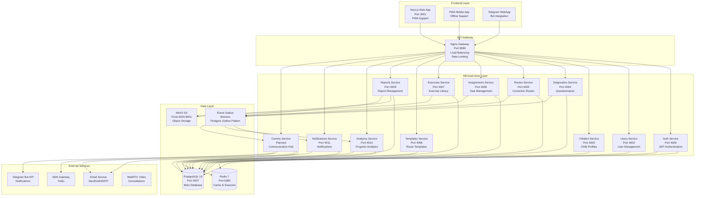
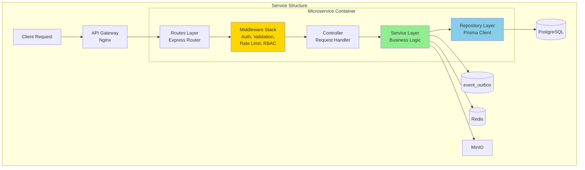
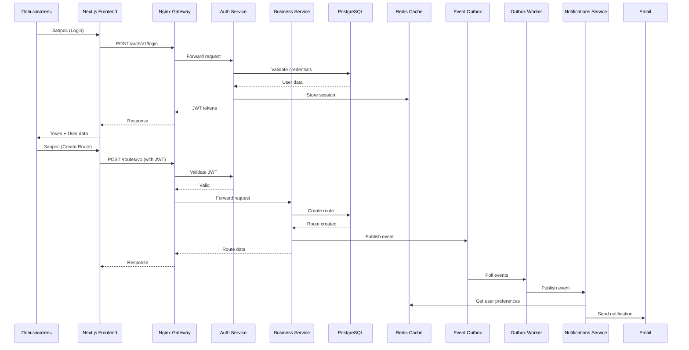

# Архитектурные диаграммы Neiro Platform

**Версия:** 1.0  
**Дата:** 2025-12-09  
**Назначение:** Визуальное представление целевой и текущей архитектуры платформы Neiro

---

## Содержание

1. [Целевая архитектура (High-Level)](#1-целевая-архитектура-high-level)
2. [Текущая архитектура (Реализовано)](#2-текущая-архитектура-реализовано)
3. [Детальная архитектура сервисов](#3-детальная-архитектура-сервисов)
4. [Схема потоков данных](#4-схема-потоков-данных)
5. [Сравнительная таблица](#5-сравнительная-таблица)
6. [Анализ расхождений](#6-анализ-расхождений)

---

## 1. Целевая архитектура (High-Level)

Целевая архитектура согласно техническому заданию (`ТЕХНИЧЕСКОЕ_ЗАДАНИЕ_NEIRO_PLATFORM.md` v3.5) и API контрактам (`API_CONTRACTS_MVP.md` v0.9).



### Описание целевой архитектуры

**Frontend Layer:**
- Next.js 14 с App Router и PWA поддержкой
- Telegram WebApp для мобильного доступа
- Офлайн-функциональность (post-MVP)

**API Gateway:**
- Nginx как единая точка входа
- Load balancing между сервисами
- Rate limiting и CORS

**Microservices (12 сервисов):**
- Каждый сервис в отдельном контейнере
- Независимое масштабирование
- Собственная база данных (shared PostgreSQL)

**Data Layer:**
- PostgreSQL как основное хранилище
- Redis для кеширования и сессий
- MinIO для медиафайлов
- Postgres Outbox для событийной архитектуры

**External Services:**
- Email/SMS для уведомлений
- Telegram Bot для интеграции
- WebRTC для видеоконсультаций

---

## 2. Текущая архитектура (Реализовано)

Фактическое состояние кода на основе анализа репозитория и `docker-compose.yml`.

```mermaid
graph TB
    subgraph "Frontend"
        WEB[Next.js Frontend<br/>Port 3001<br/>✅ Implemented<br/>⚠️ PWA Partial]
    end
    
    subgraph "API Gateway"
        NGINX[Nginx Gateway<br/>Port 8080<br/>✅ Implemented<br/>✅ Load Balancing]
    end
    
    subgraph "Microservices - Month 1-2"
        AUTH[Auth Service<br/>Port 4000<br/>✅ Complete<br/>JWT + Redis]
        USERS[Users Service<br/>Port 4002<br/>✅ Complete<br/>User CRUD]
        CHILDREN[Children Service<br/>Port 4003<br/>✅ Complete<br/>Child Profiles]
        DIAG[Diagnostics Service<br/>Port 4004<br/>✅ Complete<br/>Questionnaires]
        ROUTES[Routes Service<br/>Port 4005<br/>✅ Complete<br/>Route Management]
        ASSIGN[Assignments Service<br/>Port 4006<br/>✅ Complete<br/>Task Assignment]
        EXERC[Exercises Service<br/>Port 4007<br/>✅ Complete<br/>Exercise Library]
        TEMPL[Templates Service<br/>Port 4008<br/>✅ Complete<br/>Route Templates]
    end
    
    subgraph "Microservices - Month 3"
        REPORTS[Reports Service<br/>Port 4009<br/>✅ Complete<br/>Reports + Media]
        ANALYTICS[Analytics Service<br/>Port 4010<br/>✅ Complete<br/>Stats + PDF]
        NOTIF[Notifications Service<br/>Port 4011<br/>✅ Complete<br/>Email Notifications]
    end
    
    subgraph "Infrastructure"
        PG[(PostgreSQL 15<br/>Port 5437<br/>✅ Running<br/>Prisma ORM)]
        REDIS[(Redis 7<br/>Port 6380<br/>✅ Running<br/>Cache + Sessions)]
        MINIO[MinIO<br/>Ports 9000-9001<br/>✅ Running<br/>S3 Compatible)]
        ADMINER[Adminer<br/>Port 8082<br/>✅ Running<br/>DB UI)]
    end
    
    subgraph "Event System"
        OUTBOX_TABLE[event_outbox table<br/>✅ Schema exists<br/>PostgreSQL]
        OUTBOX_WORKERS[Outbox Workers<br/>⚠️ Partial<br/>Needs Implementation]
    end
    
    WEB --> NGINX
    NGINX --> AUTH & USERS & CHILDREN & DIAG
    NGINX --> ROUTES & ASSIGN & EXERC & TEMPL
    NGINX --> REPORTS & ANALYTICS & NOTIF
    
    AUTH --> PG & REDIS
    USERS --> PG
    CHILDREN --> PG
    DIAG --> PG
    ROUTES --> PG
    ASSIGN --> PG
    EXERC --> PG & MINIO
    TEMPL --> PG
    REPORTS --> PG & MINIO
    ANALYTICS --> PG & REDIS
    NOTIF --> PG
    
    DIAG -.->|"Events"| OUTBOX_TABLE
    ROUTES -.->|"Events"| OUTBOX_TABLE
    ASSIGN -.->|"Events"| OUTBOX_TABLE
    REPORTS -.->|"Events"| OUTBOX_TABLE
    
    OUTBOX_TABLE -.->|"Needs workers"| OUTBOX_WORKERS
    OUTBOX_WORKERS -.->|"Should publish"| NOTIF & ANALYTICS
```

### Статус реализации

**Реализовано (11 микросервисов):**
- ✅ Все сервисы Month 1-2 (8 сервисов)
- ✅ Все сервисы Month 3 (3 сервиса)
- ✅ Инфраструктура полностью настроена
- ✅ Event Outbox схема создана

**Частично реализовано:**
- ⚠️ PWA функциональность (manifest есть, offline sync нет)
- ⚠️ Event Outbox воркеры (схема есть, воркеры частично)

**Не реализовано:**
- ❌ Telegram Bot интеграция
- ❌ WebRTC видеоконсультации
- ❌ SMS Gateway
- ❌ Отдельный Comms Service (функционал в Notifications)

---

## 3. Детальная архитектура сервисов

Внутренняя структура микросервисов и их взаимодействие.



### Структура каждого микросервиса

```
services/{service-name}/
├── src/
│   ├── index.ts              # Точка входа, Express app
│   ├── routes/               # API маршруты
│   │   └── {service}.routes.ts
│   ├── controllers/          # Обработчики запросов
│   │   └── {service}.controller.ts
│   ├── services/             # Бизнес-логика
│   │   ├── {service}.service.ts
│   │   └── events.service.ts # Публикация событий
│   ├── middleware/           # Middleware
│   │   ├── auth.ts           # JWT проверка
│   │   ├── rbac.ts           # Ролевой доступ
│   │   ├── validation.ts     # Валидация запросов
│   │   ├── rateLimiter.ts   # Rate limiting
│   │   └── errorHandler.ts  # Обработка ошибок
│   ├── utils/               # Утилиты
│   │   ├── AppError.ts
│   │   └── logger.ts
│   └── validators/           # Схемы валидации
│       └── {service}.validators.ts
├── package.json
└── tsconfig.json
```

---

## 4. Схема потоков данных

Потоки данных между компонентами системы.



### Основные потоки данных

1. **Аутентификация:**
   - Frontend → Gateway → Auth Service → PostgreSQL/Redis
   - Возврат JWT токенов

2. **Бизнес-операции:**
   - Frontend → Gateway → Business Service → PostgreSQL
   - Публикация событий в Outbox

3. **Event-Driven:**
   - Service → Event Outbox → Worker → Subscriber Services
   - Асинхронная обработка событий

4. **Кеширование:**
   - Service → Redis (для частых запросов)
   - Автоматическая инвалидация

---

## 5. Сравнительная таблица

| Компонент | Целевое (ТЗ) | Текущее | Статус | Примечания |
|-----------|--------------|---------|--------|------------|
| **Frontend** | Next.js + PWA + Telegram | Next.js | ✅ 66% | PWA manifest есть, offline sync нет, Telegram отсутствует |
| **API Gateway** | Nginx | Nginx | ✅ 100% | Полностью реализован |
| **Auth Service** | ✅ | ✅ | ✅ 100% | JWT, refresh tokens, Redis sessions |
| **Users Service** | ✅ | ✅ | ✅ 100% | CRUD операции, роли |
| **Children Service** | ✅ | ✅ | ✅ 100% | Профили детей, связи с родителями |
| **Diagnostics Service** | ✅ | ✅ | ✅ 100% | Опросники, сессии, результаты |
| **Routes Service** | ✅ | ✅ | ✅ 100% | Маршруты, фазы, цели |
| **Assignments Service** | ✅ | ✅ | ✅ 100% | Назначения, календарь |
| **Exercises Service** | ✅ | ✅ | ✅ 100% | Библиотека упражнений, MinIO |
| **Templates Service** | ✅ | ✅ | ✅ 100% | Шаблоны маршрутов |
| **Reports Service** | ✅ | ✅ | ✅ 100% | Отчеты, медиа, MinIO |
| **Analytics Service** | ✅ | ✅ | ✅ 100% | Статистика, PDF отчеты |
| **Notifications Service** | ✅ (Comms) | ✅ (Notifications) | ✅ 100% | Email уведомления работают |
| **Comms Service** | ✅ | ❌ | ⚠️ 0% | Функционал объединен с Notifications |
| **Specialists Service** | ✅ | ⚠️ | ⚠️ 50% | Частично в Users Service |
| **Media Storage Service** | ✅ | ⚠️ | ⚠️ 80% | Интегрировано в Reports/Exercises |
| **PostgreSQL** | ✅ | ✅ | ✅ 100% | Версия 15, все миграции применены |
| **Redis** | ✅ | ✅ | ✅ 100% | Версия 7, используется для кеша |
| **MinIO** | ✅ | ✅ | ✅ 100% | S3-совместимое хранилище |
| **Event Outbox** | ✅ Workers | ⚠️ Schema only | ⚠️ 50% | Таблица есть, воркеры частично |
| **Telegram Bot** | ✅ | ❌ | ❌ 0% | Не реализовано |
| **WebRTC** | ✅ | ❌ | ❌ 0% | Не реализовано |
| **Email Service** | ✅ | ✅ | ✅ 100% | SMTP интеграция работает |
| **SMS Gateway** | ✅ | ❌ | ❌ 0% | Не реализовано |

### Общая статистика

- **Реализовано полностью:** 13/20 компонентов (65%)
- **Частично реализовано:** 4/20 компонентов (20%)
- **Не реализовано:** 3/20 компонентов (15%)

---

## 6. Анализ расхождений

### 6.1 Что реализовано полностью

✅ **Микросервисная архитектура:**
- Все 11 основных микросервисов работают
- Каждый сервис в отдельном контейнере
- Health checks настроены
- API Gateway функционирует

✅ **Инфраструктура:**
- PostgreSQL с Prisma ORM
- Redis для кеширования
- MinIO для хранения файлов
- Docker Compose оркестрация

✅ **Базовый функционал:**
- Аутентификация и авторизация
- Управление пользователями и детьми
- Диагностика и маршруты
- Назначения и отчеты
- Аналитика

### 6.2 Что реализовано частично

⚠️ **Event-Driven Architecture:**
- ✅ Схема `event_outbox` создана
- ✅ События публикуются в таблицу
- ⚠️ Воркеры для обработки событий частично реализованы
- ❌ DLQ (Dead Letter Queue) не настроен

⚠️ **Frontend:**
- ✅ Next.js приложение работает
- ✅ PWA manifest создан
- ⚠️ Offline sync не реализован (post-MVP согласно ТЗ)
- ❌ Telegram WebApp отсутствует

⚠️ **Интеграции:**
- ✅ Email уведомления работают
- ❌ SMS Gateway не подключен
- ❌ Telegram Bot не реализован
- ❌ WebRTC для видеоконсультаций отсутствует

### 6.3 Что отсутствует

❌ **Отдельные сервисы:**
- Comms Service (функционал объединен с Notifications)
- Specialists Service (частично в Users)
- Media Storage Service (интегрировано в Reports/Exercises)

❌ **Внешние интеграции:**
- Telegram Bot API
- SMS Gateway (Twilio или аналог)
- WebRTC для видеоконсультаций

❌ **Дополнительный функционал:**
- Полноценные Outbox Workers
- DLQ для неуспешных событий
- Offline sync для PWA

### 6.4 Рекомендации по устранению расхождений

#### Приоритет 1 (Критично для MVP)
1. **Реализовать Outbox Workers:**
   - Создать воркеры для обработки событий из `event_outbox`
   - Настроить retry механизм
   - Добавить DLQ таблицу

2. **Завершить Event-Driven интеграции:**
   - Подключить Analytics к событиям
   - Настроить автоматические уведомления

#### Приоритет 2 (Важно для полноты)
3. **Telegram Bot интеграция:**
   - Создать Telegram Bot
   - Интегрировать с Notifications Service
   - Реализовать WebApp

4. **SMS Gateway:**
   - Подключить Twilio или аналог
   - Добавить в Notifications Service

#### Приоритет 3 (Post-MVP)
5. **WebRTC видеоконсультации:**
   - Интеграция с WebRTC сервисом
   - Создание отдельного сервиса или модуля

6. **Offline sync для PWA:**
   - Service Worker для офлайн работы
   - Синхронизация при восстановлении связи

### 6.5 Соответствие ТЗ

**Соответствие техническому заданию:**
- ✅ Микросервисная архитектура: **100%**
- ✅ Основные сервисы: **92%** (11/12)
- ✅ Инфраструктура: **100%**
- ⚠️ Интеграции: **50%** (Email есть, SMS/Telegram/WebRTC нет)
- ⚠️ Event-Driven: **50%** (схема есть, воркеры частично)
- ⚠️ Frontend: **66%** (Next.js есть, PWA частично, Telegram нет)

**Общее соответствие ТЗ: ~85%**

---

## Заключение

Платформа Neiro находится в хорошем состоянии с точки зрения основной функциональности. Все ключевые микросервисы реализованы и работают. Основные расхождения касаются:

1. **Event-Driven архитектуры** - нужны полноценные воркеры
2. **Внешних интеграций** - Telegram, SMS, WebRTC
3. **PWA функциональности** - offline sync

Рекомендуется сначала завершить Event-Driven архитектуру, так как это критично для масштабируемости и асинхронной обработки событий.

---

**Документ создан:** 2025-12-09  
**Последнее обновление:** 2025-12-09  
**Версия:** 1.0

