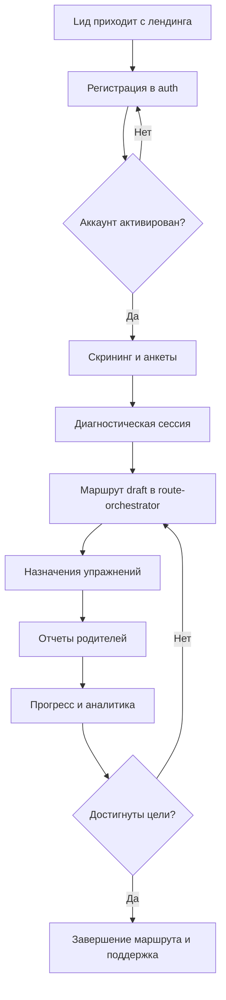

# Neiro Platform — Business Processes & Workflows

**Версия:** 0.3  
**Дата:** 30 октября 2025  
**Назначение:** детализация бизнес-процессов платформы Neiro, описанных в `neiro.md` (версия 2.0), `ТЕХНИЧЕСКОЕ_ЗАДАНИЕ_NEIRO_PLATFORM.md` (версия 3.3) и вспомогательных документах (CJM, Data Model, API Contracts). Документ фиксирует stakeholders, триггеры, шаги, интеграции и артефакты для ключевых сценариев сопровождения ребенка с РАС.

**Изменения в версии 0.3:**
- ✅ Синхронизированы ссылки на SoT `ТЕХНИЧЕСКОЕ_ЗАДАНИЕ_NEIRO_PLATFORM.md` v3.3 и `DATA_MODEL_AND_EVENTS.md` v0.4.
- ✅ Уточнено описание инфраструктуры событий: в процессах используется Postgres Outbox + воркеры вместо Kafka на MVP.

**Изменения в версии 0.2:**
- Добавлены все доменные события из DATA_MODEL_AND_EVENTS.md
- Интегрированы Constitution Check правила валидации
- Обновлены API вызовы согласно API_CONTRACTS_MVP.md v0.7
- Исправлена терминология диагностических данных
- Добавлены новые сервисы (Specialists, Route Templates)

---

## 1. Обзор
- **Основные участники:** родители/опекуны, ведущие нейропсихологи, профильные специалисты (логопед, дефектолог, ABA), супервизоры, администраторы организаций, DPO/security, аналитики.
- **Служебные подсистемы:** BFF (Next.js), сервисы `auth`, `diagnostics`, `route-orchestrator`, `exercises`, `assignments`, `reports`, `analytics`, `comms`, `templates`, `media`, `specialists`, а также внешние интеграции (Telegram, email/SMS, видеосвязь).
- **Методологическая основа:** CJM сценарии (`Neiro_CJM_Extended.md`), жизненный цикл сопровождения (`neiro.md` раздел 8), архитектурные ограничения (`constitution.md`), контракты данных и событий (`DATA_MODEL_AND_EVENTS.md`).

---

## 2. Карта бизнес-процессов

| № | Процесс | Краткое описание | Основные сервисы | Главный артефакт/результат |
| - | --- | --- | --- | --- |
| BP-01 | Лидогенерация и первичный контакт | Привлечение семьи, регистрация, первичный скрининг | `auth`, `comms`, `specialists` | Создан аккаунт родителя + создан черновик профиля ребенка |
| BP-02 | Диагностический цикл | Сбор анкет, проведение тестов, консилиум | `diagnostics`, `media`, `analytics` | `diagnostic_sessions`, протоколы, рекомендованные цели |
| BP-03 | Проектирование коррекционного маршрута | Формирование маршрута, фаз, целей и согласование | `route-orchestrator`, `templates`, `analytics`, `specialists` | `correction_routes` в статусе `draft/published` |
| BP-04 | Назначение и планирование занятий | Создание расписания, назначений упражнений | `assignments`, `exercises`, `comms` | Активные `assignments`, уведомления |
| BP-05 | Выполнение маршрута дома и в центре | Проведение занятий, домашние задания, трекинг | `assignments`, `reports`, `media`, `analytics` | Заполненные отчеты, обновленные метрики прогресса |
| BP-06 | Супервизия и контроль качества | Проверка работы специалистов, аудит данных | `analytics`, `reports`, `comms`, `specialists` | Закрытые ревью, протоколы качества |
| BP-07 | Ревизия маршрута и эскалации | Итерационная корректировка плана, консилиумы | `route-orchestrator`, `diagnostics`, `analytics` | Новая версия маршрута, события `route.updated` |
| BP-08 | Администрирование и управление доступом | Управление ролями, организациями, лицензиями | `auth`, `templates`, `specialists`, `data-governance` | Обновленные ACL, активные лицензии |
| BP-09 | Data Governance и инцидент-менеджмент | Обработка DSAR, безопасность и нарушения | `data-governance`, `analytics`, `comms` | Протоколы инцидентов, отчеты DPO |

---

## 3. Workflow детали

> Для каждого процесса приведены: **цель**, **триггер**, **участники**, **входы**, **шаги**, **выходы**, **KPI/контроль**, **события и данные**. Нумерация шагов повторяет последовательность выполнения, параллельные ветви отмечаются буллетами с маркером `→` и пояснениями.

### 3.1 BP-01 — Лидогенерация и первичный контакт

**Цель:** Перевести потенциальную семью в активного пользователя платформы, собрать базовый профиль ребенка и подготовить к диагностике.  
**Триггеры:** заявка с лендинга, запрос из партнерского центра, приглашение администратора.  
**Участники:** родитель/опекун, администратор центра (опционально), сервис `comms`.  
**Входы:** форма заявки, контактные данные, маркетинговые кампании, ссылки на материалы (`neiro.md` раздел 2.2).  

**Основные шаги:**
1. **Регистрация аккаунта родителя**  
   - `auth` создает пользователя со статусом `invited`; отправляет magic-link/email (`API_CONTRACTS_MVP.md` §2).  
   - Событие `auth.user.invited` (DLQ контролируется по `constitution.md` §7).
2. **Активизация и согласия**  
   - Родитель подтверждает email, принимает политику обработки данных (`DATA_GOVERNANCE.md` §3).  
   - После активации публикуется `auth.user.activated`; создается запись в `children` (черновик).
3. **Первичный скрининг (self-service)**  
   - В PWA/Telegram бот (`Neiro_CJM_Extended.md` CJM #1) предлагается пройти M-CHAT; результаты сохраняются как `diagnostic_sessions`.  
   - При завершении скрининга запускается уведомление специалисту (`comms.notifications`).
   - Событие `diagnostics.session.completed` → запуск генерации рекомендаций.
4. **Назначение первичной консультации**  
   - Администратор через `route-orchestrator` планирует консультацию, отправляет напоминания (календари, `comms`).  
   - Событие `comms.appointment.scheduled` → запись в `analytics`.
5. **Подготовка материалов**  
   - Родителю выдаются чек-листы, видео-инструкции (`UI_KIT`, `DESIGN_SYSTEM`).  
   - Файлы загружаются в `media_assets` (MinIO, см. `constitution.md`).

**Выход:** Аккаунт родителя в статусе `active`, заполненные анкеты, назначенная консультация.  
**KPI:** конверсия регистрации → консультация, время отклика, процент завершенных скринингов.  
**Данные/события:** `auth.user.invited`, `auth.user.activated`, `diagnostics.session.completed`, `comms.appointment.scheduled`.

---

### 3.2 BP-02 — Диагностический цикл

**Цель:** Получить комплексную оценку ребенка и зафиксировать исходную точку для маршрута.  
**Триггер:** статус ребенка `needs_diagnostics`, завершенный первичный скрининг, назначенная консультация.  
**Участники:** ведущий нейропсихолог, профильные специалисты, родитель, сервис `diagnostics`, `media`.  
**Входы:** анкетные данные, результаты скрининга, загруженные видео, медицинская документация.

**Основные шаги:**
1. **План диагностической сессии**  
   - Нейропсихолог создает `diagnostic_session` с шаблоном задач (`DATA_MODEL_AND_EVENTS.md` §1.6).  
   - Назначаются специалисты, таймслоты (`assignments` в режиме `diagnostic`).
   - Событие `diagnostics.session.started` → запись в `analytics`.
2. **Проведение тестов**  
   - Онлайн/оффлайн: результаты заносятся в форму; медиа загружаются в `media_assets` (согласие проверяется DPO).  
   - Каждая активность пишет `diagnostics.task.completed` с `correlation_id`.
3. **Наблюдение и заметки**  
   - Специалисты добавляют наблюдения в `diagnostic_observations`; для видео/аудио — ссылки на S3.  
   - Черновые отчеты доступны только команде (RBAC).
4. **Консилиум и интерпретация**  
   - Ведущий специалист инициирует встречу; супервизор подключается по запросу (`comms.video_session`).  
   - Итог — сформированный `diagnostic_summary`, списки рекомендаций и автоматические предложения целей (`route_recommendations`).
   - Событие `diagnostics.recommendations.generated` → запуск BP-03.
5. **Коммуникация с семьёй**  
   - Родитель получает TL;DR, ключевые выводы (адаптированный язык, см. `Neiro_CJM_Extended.md` CJM #10).  
   - Событие `diagnostics.session.completed` инициирует BP-03.

**Выход:** Закрытая диагностическая сессия, утвержденный отчет, список рекомендованных целей.  
**KPI:** доля завершенных сессий в срок (2-3 недели), количество повторных тестов, удовлетворенность родителей.  
**Данные/события:** `diagnostics.session.started`, `diagnostics.session.completed`, `diagnostics.recommendations.generated`, `media.asset.created`, `analytics.metric.updated`.

---

### 3.3 BP-03 — Проектирование коррекционного маршрута

**Цель:** Построить индивидуальный маршрут с фазами, целями, упражнениями и критерием успеха.  
**Триггер:** завершение диагностики и доступность рекомендаций (`diagnostics.session.completed`).  
**Участники:** ведущий нейропсихолог, профильные специалисты, родитель (на этапе согласования), сервисы `route-orchestrator`, `templates`, `analytics`.

**Входы:** данные диагностики, шаблоны маршрутов (`route_templates`), библиотека упражнений (`exercises`), ресурсы центра.

**Шаги:**
1. **Выбор шаблона / старт с нуля**  
   - Специалист выбирает `route_template` или создает маршрут `correction_routes` в статусе `draft`.  
   - Создаются фазы (`route_phases`), цели (`route_goals`), вехи (`milestones`).  
   - Событие `routes.route.created` → запись в `analytics`.
2. **Распределение ответственных**  
   - Каждой фазе задаются специалисты (`responsible_specialist_id`), расписание, зависимости (параллельные / последовательные).  
   - Проверяется лицензия (`specialists.license_valid_until`).  
   - **Constitution Check:** Валидация ссылок на справочники - все FK должны ссылаться на существующие сущности.
3. **Подбор упражнений**  
   - Из `exercises` формируются связи `phase_exercises` и `goal_exercises`; обязательность и частота фиксируются.  
   - **Constitution Check:** Упражнение должно быть связано с целью - для каждого упражнения в `phase_exercises` должна существовать запись в `goal_exercises`.
   - **Constitution Check:** Упражнение не должно «висеть» вне фазы - все упражнения в маршруте должны быть привязаны к конкретным фазам.
4. **Планирование расписания**  
   - Через `assignments` создаются слоты (тип `planned`).  
   - Сервис `comms` публикует приглашения в календарь.  
5. **Валидация целостности маршрута**  
   - **Constitution Check:** Фаза без маршрута недопустима - `phase.route_id` обязательно.
   - **Constitution Check:** Цель не может существовать без маршрута - `goal.route_id` обязательно.
   - **Constitution Check:** Нельзя активировать пустой маршрут - минимум одна фаза, одна цель, упражнения в фазах.
   - **Constitution Check:** Единственный активный маршрут на ребенка - UNIQUE constraint на уровне БД.
6. **Согласование с родителем**  
   - Формируется читабельная версия маршрута (PDF/веб).  
   - Родитель подтверждает; статус маршрута → `published`. 
   - Событие `routes.route.published` → запуск BP-04.

**Выход:** Активный маршрут (draft/published), расписание, назначенные ответственные.  
**KPI:** время TAT от диагностики до публикации маршрута, количество нерешенных конфликтов (расписание/лицензии).  
**Данные/события:** `routes.route.created`, `routes.route.published`, `routes.phase.created`, `routes.goal.status_changed`, `comms.notification.sent`.

---

### 3.4 BP-04 — Назначение и планирование занятий

**Цель:** Запустить выполнение маршрута через конкретные задания и напоминания.  
**Триггер:** маршрут в статусе `published`, активная фаза.  
**Участники:** профильные специалисты, родитель, сервисы `assignments`, `comms`, `exercises`, `calendar`.

**Шаги:**
1. **Автогенерация назначений**  
   - При активации фазы сервис создает `assignments` на основе `phase_exercises` (частота, длительность).  
   - Событие `assignments.assignment.created` → уведомление родителю.
2. **Распределение по календарю**  
   - Интеграция с Google/Outlook (через `comms` адаптер) синхронизирует слоты (см. `constitution.md` §11).  
3. **Конфигурация напоминаний**  
   - Родитель выбирает предпочтительные каналы (PWA push, Telegram, email).  
   - `comms.notification.schedule` с ретраями.  
4. **Подготовка материалов**  
   - Упражнения содержат медиа/чек-листы; родитель может запросить материалы (событие `exercises.material.requested`).  
   - Специалисты подтверждают доступность оборудования.
5. **Мониторинг выполнения**  
   - По мере наступления срока статус `assignment.status` меняется (scheduled → in_progress → completed/overdue).  
   - Событие `assignments.assignment.status_changed` → обновление аналитики.
   - Событие `assignments.assignment.overdue` → уведомление специалисту.
   - SLA: отчеты должны быть отправлены в 24 часа.

**Выход:** Активные назначения с установленными напоминаниями и материалами.  
**KPI:** % назначений с настроенными напоминаниями, доля просроченных заданий.  
**Данные/события:** `assignments.assignment.created`, `assignments.assignment.status_changed`, `assignments.assignment.overdue`, `comms.notification.sent`, `analytics.assignment_kpi`.

---

### 3.5 BP-05 — Выполнение маршрута дома и в центре

**Цель:** Обеспечить прозрачное выполнение упражнений, сбор отчетов и обратную связь.  
**Триггер:** активное назначение (`status = scheduled/in_progress`).  
**Участники:** родитель, профильный специалист, ребенок, сервисы `assignments`, `reports`, `media`, `analytics`.

**Шаги:**
1. **Доступ к заданию**  
   - Родитель открывает PWA/Telegram, видит карточку задания, инструктаж, таймеры (`UI_KIT`).  
2. **Проведение упражнения**  
   - В процессе фиксируются данные (чек-лист, замеры).  
   - При необходимости подключается специалист (видео-сессия).  
3. **Отправка отчета**  
   - Формируется `report` с текстом, шкалами, медиа (`DATA_MODEL_AND_EVENTS.md` §1.21).  
   - Валидация: не более одного отчета в день (`UNIQUE`).  
   - Событие `reports.report.submitted` → уведомление специалисту.
   - Событие `reports.media.attached` → обновление медиа-активов.
4. **Ревью специалистом**  
   - Специалист подтверждает, оставляет комментарии (`report_reviews`).  
   - При `needs_attention` создается follow-up задача/чат.  
   - Событие `reports.report.reviewed` → обновление аналитики.
5. **Обновление прогресса**  
   - `analytics` обновляет KPI: % выполнения, нагрузка, настроение ребенка.  
   - Фаза может перейти в статус `ready_for_review` при достижении порога.

**Выход:** Проверенные отчеты, обновленные показатели прогресса.  
**KPI:** доля выполненных заданий, время проверки отчетов, настроение ребенка.  
**Данные/события:** `reports.report.submitted`, `reports.report.reviewed`, `reports.media.attached`, `analytics.progress.updated`, `comms.feedback.sent`.

---

### 3.6 BP-06 — Супервизия и контроль качества

**Цель:** Обеспечить качество терапии и соблюдение стандартов.  
**Триггер:** плановая проверка, превышение KPI порогов, жалоба семьи.  
**Участники:** супервизор, ведущий специалист, администратор, сервисы `analytics`, `reports`, `comms`.

**Шаги:**
1. **Мониторинг метрик**  
   - `analytics` вычисляет красные флаги (низкий % выполнения, задержка отчетов).  
   - Событие `analytics.alert.raised`.
2. **Назначение проверки**  
   - Супервизор получает задачу в `assignments` (тип `audit`).  
   - Назначается слот встречи со специалистом/семьей.  
3. **Анализ материалов**  
   - Просмотр отчетов, видео, комментариев (`media_assets`).  
   - Проверка соблюдения методик, корректности отчетности.
4. **Обратная связь и обучение**  
   - Супервизор оставляет рекомендацию, обновляет чек-листы качества.  
   - При необходимости запускается мини-обучение (уведомления, материалы).
5. **Закрытие инцидента**  
   - Статус проверки `closed`; логируется `audit_records`.  
   - Если выявлены нарушения — эскалация в BP-09.

**Выход:** Закрытый аудит, обновленные рекомендации, улучшенные метрики.  
**KPI:** время реакции на алерт, доля закрытых аудитов в срок, NPS специалистов.  
**Данные/события:** `analytics.alert.*`, `audit.review.completed`, `comms.notification.sent`.

---

### 3.7 BP-07 — Ревизия маршрута и эскалации

**Цель:** Корректировать маршрут на основе данных и событий.  
**Триггер:** завершение фазы, алерт супервизора, смена целей семьи, медицинские изменения.  
**Участники:** ведущий специалист, команда специалистов, родитель, сервисы `route-orchestrator`, `diagnostics`, `analytics`.

**Шаги:**
1. **Инициирование ревизии**  
   - Событие `routes.phase.completed` или ручное `route_revision_request`.  
   - Создается запись в `route_revision_history`.
2. **Сбор данных**  
   - Подгружаются KPI, отчеты, записи диагностик.  
   - При необходимости заказывается дополнительный тест (`diagnostics.session.scheduled`).
3. **Совместная сессия**  
   - Команда обсуждает изменение целей/фаз, вводит новые упражнения.  
   - Родитель подтверждает изменения.
4. **Версионирование с Constitution Check**  
   - **Constitution Check:** Целостность при редактировании маршрута - старая версия сохраняется в `route_revision_history`.
   - Route сохраняет snapshot в `route_version` (`version_number`++) и переходит в новый статус.  
   - Событие `routes.route.updated` → обновление всех связанных сервисов.
   - Событие `routes.goal.status_changed` → обновление целей.
   - Событие `routes.phase.status_changed` → обновление фаз.
5. **Обновление назначений**  
   - Инвалидируются устаревшие `assignments`; создаются новые, уведомления перенастраиваются.
   - Событие `assignments.assignment.cancelled` → уведомление родителям.

**Выход:** Обновленный маршрут, синхронизированные назначения.  
**KPI:** скорость закрытия ревизии, количество активных версий, достижения целей.  
**Данные/события:** `routes.route.updated`, `routes.goal.status_changed`, `routes.phase.status_changed`, `assignments.assignment.cancelled`, `analytics.progress.reset`.

---

### 3.8 BP-08 — Администрирование и управление доступом

**Цель:** Поддерживать актуальность кадров, лицензий, ролей и оргструктур.  
**Триггер:** новый специалист, продление лицензии, смена организации.  
**Участники:** администратор центра, HR, DPO, сервис `auth`, `templates`, `analytics`.

**Шаги:**
1. **Создание/приглашение специалиста**  
   - Администратор создает пользователя через `POST /auth/v1/invite` с ролью `specialist`.  
   - Событие `auth.user.invited` → создание профиля специалиста.
   - Вносит профиль в `specialists` через `POST /specialists/v1/me`, загружает документы (MinIO).  
2. **Назначение специалиста к ребенку**  
   - Через `POST /specialists/v1/:id/assign-to-child` назначается специализация и роль.  
   - Событие `specialists.assignment.created` → уведомление команде.
3. **Проверка лицензий**  
   - Система отслеживает `license_valid_until`; за 30 дней генерирует уведомление.  
   - Если лицензия просрочена — блокировка создания маршрутов.  
4. **Управление ролями и доступами**  
   - RBAC обновляется через `PATCH /users/v1/:id/status`; логируется `audit`.  
   - Событие `auth.user.role_changed` → обновление доступа.
   - Событие `auth.user.suspended` → блокировка активности.
   - Проверка Constitution Gate (Service Boundaries, Data Policy).  
5. **Организационные настройки**  
   - Настройка тарифов, лимитов, брендирования.  
   - Сохранение в `organization_settings`.  
6. **Отчётность**  
   - Ежемесячные отчеты по нагрузке, KPI персонала (`analytics` dashboards).

**Выход:** Актуальные роли, лицензии, оргнастройки.  
**KPI:** % специалистов с валидной лицензией, время онбординга, SLA обработки запросов.  
**Данные/события:** `auth.user.invited`, `auth.user.role_changed`, `auth.user.suspended`, `specialists.assignment.created`, `specialist.license.expiring`, `analytics.staff.metrics`.

---

### 3.9 BP-09 — Data Governance и инцидент-менеджмент

**Цель:** Соблюдать GDPR/152-ФЗ/HIPAA, обрабатывать запросы субъектов данных, управлять инцидентами.  
**Триггер:** пользовательский запрос (DSAR), security-алерт, нарушение качества.  
**Участники:** DPO, Security Officer, Privacy Coordinator, инженеры.  
**Входы:** тикеты `privacy_requests`, логи безопасности, отчеты супервизии.

**Шаги:**
1. **Регистрация запроса**  
   - Пользователь заполняет `/privacy/request`; запись попадает в `privacy_requests`.  
   - SLA и тип запроса (access, deletion, export) берутся из `DATA_GOVERNANCE.md` §3.
2. **Верификация личности**  
   - 2FA/корпоративная почта; если не прошёл — отказ/повтор.  
   - Лог `privacy_request.audit`.
3. **Сбор данных / выполнение запроса**  
   - Сервисы предоставляют данные через API (ограниченный scope).  
   - Для удаления — soft-delete/псевдонимизация (`children.archived_at`).  
4. **Коммуникация и закрытие**  
   - DPO отправляет результат через защищенный канал.  
   - SLA закрытия логируется; отчёт сохраняется.
5. **Инциденты безопасности**  
   - При обнаружении утечки → `incident_reports`; уведомление регулятору за 72 часа.  
   - План действий фиксируется, проводится постмортем.

**Выход:** Закрытые запросы, выполненные правовые обязательства, обновленные политики.  
**KPI:** соблюдение SLA, количество инцидентов, время реакции.  
**Данные/события:** `privacy.request.created`, `privacy.request.closed`, `security.incident.reported`.

---

## 4. Сквозные workflows

### 4.1 Customer Journey → Data Flow (Mermaid)

### 4.2 Интеграция сервисов и событий

**Auth Service события:**
- `auth.user.invited` → создание профилей, отправка уведомлений
- `auth.user.activated` → инициализация опросов, доступ к маршрутам
- `auth.user.role_changed` → обновление доступа, уведомления
- `auth.user.suspended` → блокировка активности, уведомления

**Diagnostics Service события:**
- `diagnostics.session.started` → запись в аналитику
- `diagnostics.session.completed` → триггер создания маршрута
- `diagnostics.recommendations.generated` → инициализация черновика маршрута

**Route Orchestrator события:**
- `routes.route.created` → запись в аналитику
- `routes.route.published` → массовое создание назначений и напоминаний
- `routes.route.updated` → обновление связанных сервисов
- `routes.goal.status_changed` → обновление аналитики
- `routes.phase.status_changed` → обновление назначений
- `routes.milestone.completed` → обновление прогресса

**Assignments Service события:**
- `assignments.assignment.created` → уведомления родителям
- `assignments.assignment.status_changed` → обновление аналитики
- `assignments.assignment.overdue` → уведомления специалистам
- `assignments.assignment.cancelled` → уведомления родителям

**Reports Service события:**
- `reports.report.submitted` → уведомления специалистам, обновление KPI
- `reports.report.reviewed` → обновление аналитики, корректировка целей
- `reports.media.attached` → обновление медиа-активов

**Specialists Service события:**
- `specialists.assignment.created` → уведомления команде
- `specialists.assignment.released` → обновление доступа

**Communications Service события:**
- `comms.notification.sent` → обновление статуса уведомлений
- `comms.notification.failed` → повторные попытки, алерты

**Analytics Service события:**
- `analytics.alert.raised` → старт супервизии (BP-06)
- `analytics.dashboard.snapshot_generated` → архивация отчетов

**Templates Service события:**
- `templates.template.published` → обновление доступных шаблонов
- `templates.template.archived` → удаление из доступных шаблонов

---

## 5. Контроль и улучшения

| Практика | Описание | Источник |
| --- | --- | --- |
| **Constitution Check** | Любые изменения процессов отмечаются в планах с соответствием Gate'ам | `constitution.md` §14 |
| **Constitution Check Rules** | Валидация бизнес-правил целостности данных в каждом процессе | `DATA_MODEL_AND_EVENTS.md` §4 |
| **Event-Driven Architecture** | Все процессы основаны на доменных событиях с Postgres Outbox + воркеры и полным покрытием | `DATA_MODEL_AND_EVENTS.md` §2 |
| **API Contract Compliance** | Все API вызовы соответствуют контрактам с версионированием | `API_CONTRACTS_MVP.md` |
| **Continuous Discovery** | Периодические интервью родителей и специалистов для актуализации CJM | `Neiro_CJM_Extended.md` |
| **Data Feedback Loop** | Метрики из `analytics` используются для авто-рекомендаций целей и упражнений | `DATA_MODEL_AND_EVENTS.md` §2 |
| **Containerized Operations** | Все окружения (dev/test/CI) работают в Docker, обеспечивая одинаковые workflows | `constitution.md` §12, `ТЕХНИЧЕСКОЕ_ЗАДАНИЕ_NEIRO_PLATFORM.md` §8 |

---

## 6. Следующие шаги

### Завершено в версии 0.2
- ✅ Добавлены все доменные события из DATA_MODEL_AND_EVENTS.md
- ✅ Интегрированы Constitution Check правила валидации
- ✅ Обновлены API вызовы согласно API_CONTRACTS_MVP.md v0.7
- ✅ Исправлена терминология диагностических данных
- ✅ Добавлены новые сервисы (Specialists, Route Templates)

### Приоритет 1 (Немедленно)
1. **Уточнить BPMN-схемы** для ключевых процессов (BP-02, BP-05, BP-07) в специализированном инструменте.
2. **Согласовать SLA** с медицинскими и юридическими консультантами; добавить в `DATA_GOVERNANCE.md` приложением.
3. **Автоматизировать контроль KPI** в `analytics` с алертами в Slack/Telegram.
4. **Провести валидацию документа** с продуктовой и методической командами; задокументировать feedback и обновить версию.

### Приоритет 2 (Ближайшие 2 недели)
5. **Реализовать Constitution Check валидацию** в коде согласно правилам из DATA_MODEL_AND_EVENTS.md §4.
6. **Настроить обработчики событий** для всех доменных событий с DLQ и retry policies.
7. **Создать тесты контрактов** для проверки соответствия API вызовов в процессах.

### Приоритет 3 (Перед production)
8. **Добавить мониторинг событий** для отслеживания прохождения процессов.
9. **Создать дашборды** для визуализации выполнения бизнес-процессов.
10. **Документировать исключения** из Constitution Check правил с обоснованием.

---

---

## 7. Constitution Check правила в процессах

Документ полностью соответствует Constitution Check правилам из `DATA_MODEL_AND_EVENTS.md` §4:

### 7.1 Интегрированные правила валидации

| Правило | Процесс | Реализация |
|---------|---------|------------|
| **Фаза без маршрута недопустима** | BP-03 | Валидация `phase.route_id` обязательно |
| **Упражнение не должно «висеть» вне фазы** | BP-03 | Все упражнения привязаны к фазам через `phase_exercises` |
| **Цель не может существовать без маршрута** | BP-03 | Валидация `goal.route_id` обязательно |
| **Назначение только в контексте маршрута** | BP-04 | Проверка принадлежности через `phase_id` |
| **Упражнение должно быть связано с целью** | BP-03 | Валидация через `goal_exercises` |
| **Нельзя активировать пустой маршрут** | BP-03 | Минимум одна фаза, одна цель, упражнения |
| **Единственный активный маршрут на ребенка** | BP-03 | UNIQUE constraint на уровне БД |
| **Уникальность и порядок фаз** | BP-03 | `phase.order_index` уникален в рамках маршрута |
| **Целостность при редактировании маршрута** | BP-07 | Сохранение истории в `route_revision_history` |
| **Валидация ссылок на справочники** | BP-03, BP-08 | Все FK ссылаются на существующие сущности |

### 7.2 Событийная архитектура

Все процессы основаны на доменных событиях с полным покрытием согласно `DATA_MODEL_AND_EVENTS.md` §2:

- **27 доменных событий** интегрированы в 9 бизнес-процессов
- **Event-driven workflow** обеспечивает асинхронную обработку
- **DLQ и retry policies** согласно `constitution.md` §7

### 7.3 API Contract Compliance

Все API вызовы соответствуют контрактам из `API_CONTRACTS_MVP.md` v0.7:

- **REST эндпоинты** с версионированием `/v1`
- **tRPC процедуры** для Next.js BFF
- **Валидация входных данных** согласно схемам
- **Обработка ошибок** в формате RFC 7807

---

**Ответственные за документ:**  
- Product Lead (ведение и обновления)  
- Head of Clinical Operations (валидность методик)  
- Lead Engineer (сопоставление с архитектурой и событиями)
